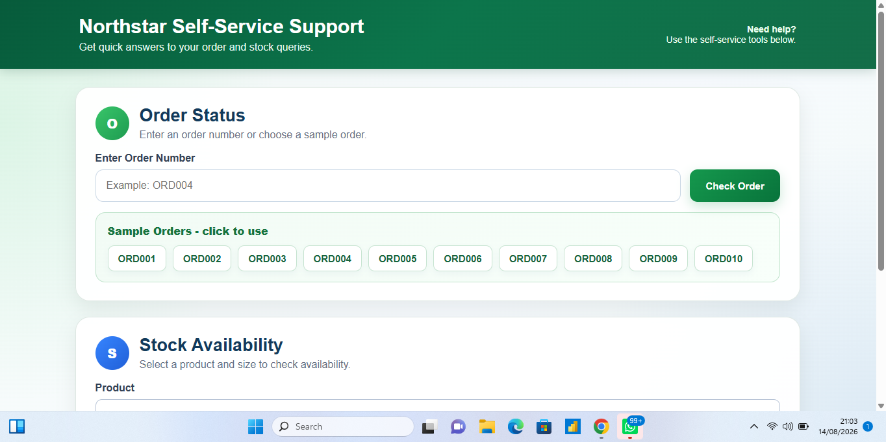
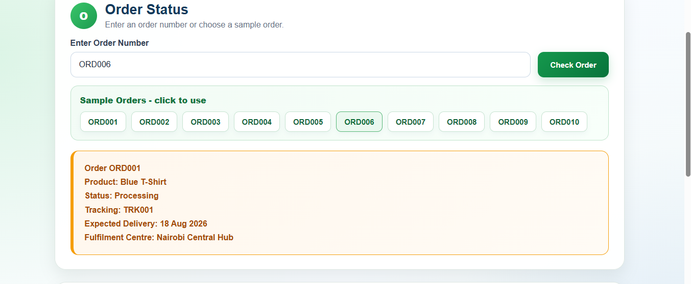
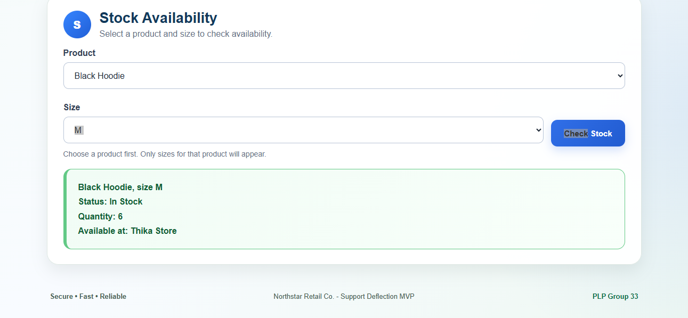
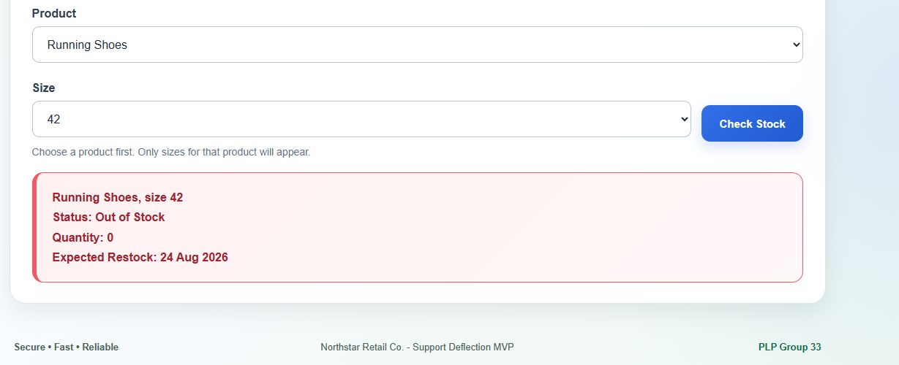
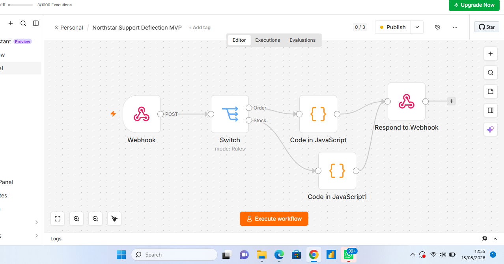

# Northstar Support Deflection MVP - Screenshot Evidence


## Purpose


This page provides visual evidence that the Northstar Retail Support Deflection MVP works end-to-end.


The MVP supports:


1. Order Status
2. Stock Availability


---


## 1. Live Frontend


The published GitHub Pages interface provides separate self-service tools for Order Status and Stock Availability.





---


## 2. Order Status - Successful Response


This screenshot shows a successful Order Status request returning customer-facing order information.





This demonstrates the flow:


Frontend → n8n Webhook → Switch → Order Code → Respond to Webhook → Frontend


---


## 3. Stock Availability - In Stock


This screenshot shows a successful Stock Availability request for an available product and size.





This confirms that the Stock branch successfully returns information to the live frontend.


---


## 4. Stock Availability - Out of Stock


This screenshot shows how the system handles an unavailable product and size combination.





The customer receives clear stock-status feedback rather than an incorrect availability response.


---


## 5. n8n Automation Workflow


The automation workflow connects the frontend to the Order Status and Stock Availability logic.





The workflow contains:


- Webhook
- Switch
- Order Code
- Stock Code
- Respond to Webhook


Both supported request types are routed through the same production workflow.


---


## End-to-End Architecture


```text
Customer
   ↓
GitHub Pages Frontend
   ↓
n8n Production Webhook
   ↓
Switch
   ├── Order → Order Code
   └── Stock → Stock Code
   ↓
Respond to Webhook
   ↓
Customer Result
Evidence Summary

The screenshots demonstrate that:

The frontend is published and accessible.
Order Status works through the live interface.
Stock Availability works through the live interface.
Both in-stock and out-of-stock responses are handled clearly.
n8n routes both supported request types.
Responses return from n8n to the customer-facing frontend.
Final MVP Status

The Northstar Support Deflection MVP successfully demonstrates two working customer self-service categories:

Order Status
Stock Availability

The frontend, n8n workflow, sample data and customer-facing responses operate together as an end-to-end MVP.
